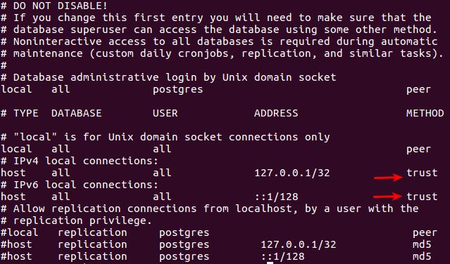
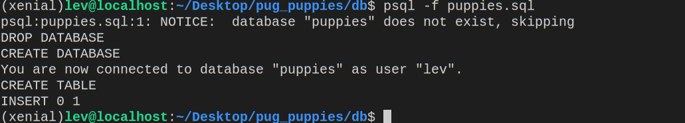

# Puppies Web App: Express - Postgres - Pug

## Linux (Chromebook) Users

To allow the server to connect to your database, you will need to modify the following file:

`/etc/postgresql/9.5/main/pg_hba.conf`

You will need to set the auth_method to `trust` (without quotes) as indicated below. This way, postgres will allow any local connection without requiring authentication.



The number - **`9.5`** is the postgres version, and may vary. Consult your instructor for help. If you do not make this change, the server will **not** be able to connect to your postgress database.

## All Users

1. To create (seed) the database, first navigate to the **`/db`** folder. Modify the `puppies.sql` file to add at least 4 puppies to the databse (it currently adds just 1). Run the following command from the terminal to execute the query.

```bash
psql -f puppies.sql
```

After pressing `<enter>` you should see something similar to the following in your command line:



2. Navigate to the root folder of the project and run `npm install`.

3. Start the server with `npm start` this will start the express server with `nodemon`.

### Routes and Pug Views

This project contains a `/views` directory with template files:

* `puppy.pug` to render a single `puppy` object. This view is complete and will be rendered on a `GET` request to `localhost:3000/puppies/:id`.
* `pyppList.pug` to render an array of `puppy` objects. This view is not complete.
* `addPuppy` to add a new puppy to the database. This view is no complete.

### Semantic UI

This project employs [semantic ui](https://semantic-ui.com) - a css framework. To learn more about how semantic ui works, you may consult the left navigation menu. Semantic UI is a pretty extensive framework, so don't feel like you have to understand all of it at once. For the sake of simplicity, the framework is loaded through a link at the top of each view. (The framework could also be downlaoded and customized locally).

### Assignment

1. Complete the `puppyList.pug` template.
2. Complete the `addPuppy.pug` template.

#### Bonus 1

Add a feature to delete puppies from the `puppy.pug` component.

#### Bonus 2

Add an `editPuppy` component that will submit a `PUT` request.